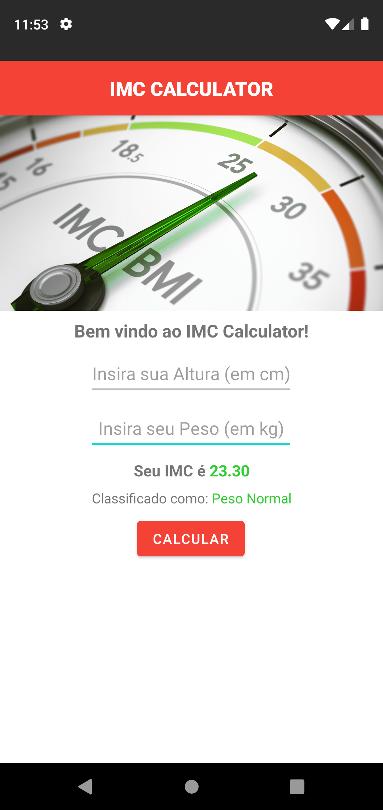

## IMC Calculator APP

#

### Atividade com objetivo de familiarizar a prática do Android Studio com seus componentes, e desenvolver um aplicativo básico com a função a sua escolha.

#

### Desenvolvido para a disciplina de Soluções WEB | UNISATC/SC

#

   
  Print do APP

